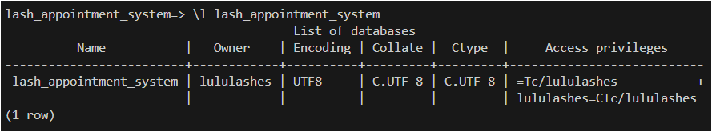
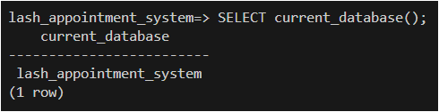

# Database Schema - Screenshots

## Database and Tables Schema

1. List database for lash_appointment_system - to check if database created:

```psql
    \l lash_appointment_system
```



---

2. Show current database - to check if in correct database:

```psql
    SELECT current_database();
```



---

3. List database tables - to check all tables created (8 in total):

```psql
    \dt
```


---

4. List `clients` table schema:

```sql
    \d clients
```


5. List `appointments` table schema:

```sql
    \d appointments
```

!

1. List `appointment_statuses` table schema:

```sql
    \d appointment_statuses
```


7. List `service_options` table schema:

```sql
    \d service_options
```


8. List `service_categories` table schema:

```sql
    \d service_categories
```


9.  List `lash_styles` table schema:

```sql
    \d lash_styles
```


10. List `payments` table schema:

```sql
    \d payments
```


11. List `payment_statuses` table schema:

```sql
    \d payment_statuses
```


