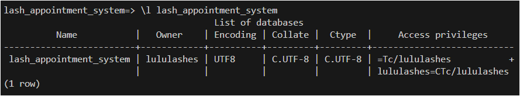
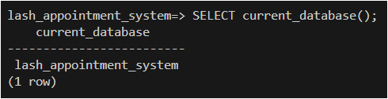
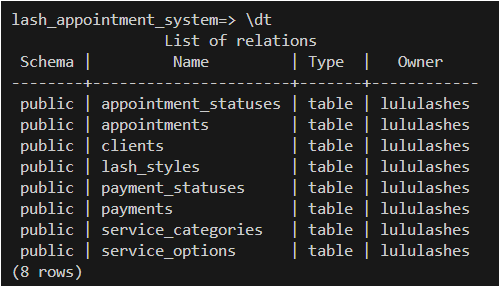

<!-- setup.md -->

# Setup Guide

---

## Table of Contents

- [Setup Guide](#setup-guide)
  - [Table of Contents](#table-of-contents)
    - [1. Relational Database using PostgreSQL](#1-relational-database-using-postgresql)
      - [Helpful PostgreSQL Reference Documents](#helpful-postgresql-reference-documents)
    - [2. Prerequisites and Tech Requirements](#2-prerequisites-and-tech-requirements)
    - [3. Installation and Setup](#3-installation-and-setup)
      - [Step 3.1 - Clone or download the repository to your local machine](#step-31---clone-or-download-the-repository-to-your-local-machine)
      - [Step 3.2 - Install PostgreSQL](#step-32---install-postgresql)
    - [4. Connecting to PostgreSQL Database](#4-connecting-to-postgresql-database)
      - [Step 4.1 - Start PostgreSQL server](#step-41---start-postgresql-server)
    - [5. Setting up the Database: Create a database](#5-setting-up-the-database-create-a-database)
      - [5.1 - List databases: To check if the specific `lash_appointment_system` database has been created successfully](#51---list-databases-to-check-if-the-specific-lash_appointment_system-database-has-been-created-successfully)
      - [5.2 - Connect to the database](#52---connect-to-the-database)
      - [5.3 Show current database: To check if in correct database](#53-show-current-database-to-check-if-in-correct-database)
    - [6. Running Database Scripts: Step by step execution](#6-running-database-scripts-step-by-step-execution)
      - [6.1 - Create all tables and relationships](#61---create-all-tables-and-relationships)
        - [6.1.1 - List database tables - to check all tables created (8 in total)](#611---list-database-tables---to-check-all-tables-created-8-in-total)
      - [6.2 - Seed predefined values for look up tables](#62---seed-predefined-values-for-look-up-tables)
      - [6.3 - Insert core seed data](#63---insert-core-seed-data)
      - [6.4 - Run single table query](#64---run-single-table-query)
      - [6.5 - Run joined table query](#65---run-joined-table-query)
      - [6.6 - Insert a new record](#66---insert-a-new-record)
      - [6.7 - Update an existing record](#67---update-an-existing-record)
      - [6.8 - Delete a record](#68---delete-a-record)
      - [6.9 - Run aggregate function queries](#69---run-aggregate-function-queries)
      - [6.10 - Filter, group and order complex queries](#610---filter-group-and-order-complex-queries)
      - [7 - Combined steps to run all scripts](#7---combined-steps-to-run-all-scripts)
  - [8. Back to README file](#8-back-to-readme-file)


---

### 1. Relational Database using PostgreSQL

This project demonstrates a relational database system designed and created using PostgreSQL (v14.8).
It includes relational database scripts for a simplified model of a lash booking system based on a fundamental development level.

The database scripts were developed using CLI and Visual Studio Code. This setup document guides you on the prerequisites and tech requirements, installation and setup, how to connect to PostgreSQL Database and create database with steps to follow for running scripts in order.

> **What is PostgreSQL?**
> *PostgreSQL is an open-source, powerful, and object-relational database system.*

#### Helpful PostgreSQL Reference Documents

- [PostgreSQL Official Documentation](https://www.postgresql.org/docs/current/index.html)
- [PostgreSQL Cheat Sheet & Quick Reference](https://quickref.me/postgres.html)
- [PostgreSQL Cheasheet](https://www.tutorialspoint.com/postgresql/postgresql_cheatsheet.htm)

---

### 2. Prerequisites and Tech Requirements

- **PostgreSQL** - Version 13 or later (recommended)
- **Command Line Terminal** - Linux Shell, Windows PowerShell or macOS Terminal
- **psql** - PostgreSQL command line tool
- **Database Credentials** - Host, username, password and database name (will need to be created)
- **Internet** - For downloading PostgreSQL and Git (if cloning repo from GitHub)
- **Visual Studio Code (Optional)** - Used for script editing but the below scripts can be run in the Command Line Terminal

---

### 3. Installation and Setup

#### Step 3.1 - Clone or download the repository to your local machine

```bash
    git clone https://github.com/lulu-codes/A1-relational-db-scripts.git    # Clone Git repository
    cd A1-relational-db-scripts                                             # Navigate into directory
```

**Important:** Run `psql` from the root of the project folder to ensure script paths work correctly.

#### Step 3.2 - Install PostgreSQL

- To download and install PostgreSQL, please visit [the official site](https://www.postgresql.org/download/) if not already installed.
- Follow the installer instructions for your operating system
- After installation, verify that it's working. You can check this by running the below command.

```bash
  psql --version        # This should return something like: psql (PostgreSQL) version number
```

---

### 4. Connecting to PostgreSQL Database

#### Step 4.1 - Start PostgreSQL server

- For Linux/macOS:

```bash
sudo -u postgres psql
```

- For Windows:

```bash
psql -U postgres
```

---

### 5. Setting up the Database: Create a database

```psql
CREATE DATABASE lash_appointment_system;
```

#### 5.1 - List databases: To check if the specific `lash_appointment_system` database has been created successfully

```psql
\l lash_appointment_system
```

It should appear similar to this:


---

#### 5.2 - Connect to the database

```psql
\c lash_appointment_system
```

#### 5.3 Show current database: To check if in correct database

```psql
SELECT current_database();
```

It should execute something similar to this:


---

### 6. Running Database Scripts: Step by step execution

> In the terminal, you can either run the scripts step-by-step, or use the combined script at [Section 7](#7-combined-steps-to-run-all-scripts).
>
> Once you have successfully connected to the database, the following steps include running scripts to create, seed and query data.

#### 6.1 - Create all tables and relationships

```psql
\i sql-scripts/1_create_tables.sql
```

##### 6.1.1 - List database tables - to check all tables created (8 in total)

```psql
\dt
```



---

#### 6.2 - Seed predefined values for look up tables

```psql
\i sql-scripts/2_seed_look_up_tables.sql
```

To view a tables schema, you can input `\d <table_name>`
For examples and screenshots, refer to [`db_schema.md`](/docs/db_schema.md)

#### 6.3 - Insert core seed data

```psql
\i sql-scripts/3_create_seed_data.sql
```

---

#### 6.4 - Run single table query

```psql
\i sql-scripts/4_query_single_table.sql
```

#### 6.5 - Run joined table query

```psql
\i sql-scripts/5_query_joined_tables.sql
```

---

#### 6.6 - Insert a new record

```psql
\i sql-scripts/6_insert_record.sql
```

#### 6.7 - Update an existing record

```psql
\i sql-scripts/7_update_record.sql
```

---

#### 6.8 - Delete a record

```psql
\i sql-scripts/8_delete_record.sql
```

---

#### 6.9 - Run aggregate function queries

```psql
\i sql-scripts/9_aggregate_functions.sql
```

#### 6.10 - Filter, group and order complex queries

```psql
\i sql-scripts/10_filter_group_order.sql
```

---

#### 7 - Combined steps to run all scripts

```psql
\i sql-scripts/00_all_scripts_in_order.sql
```

---

## 8. Back to README file

Refer to [README.md](/README.md) for more details about the project.

---
